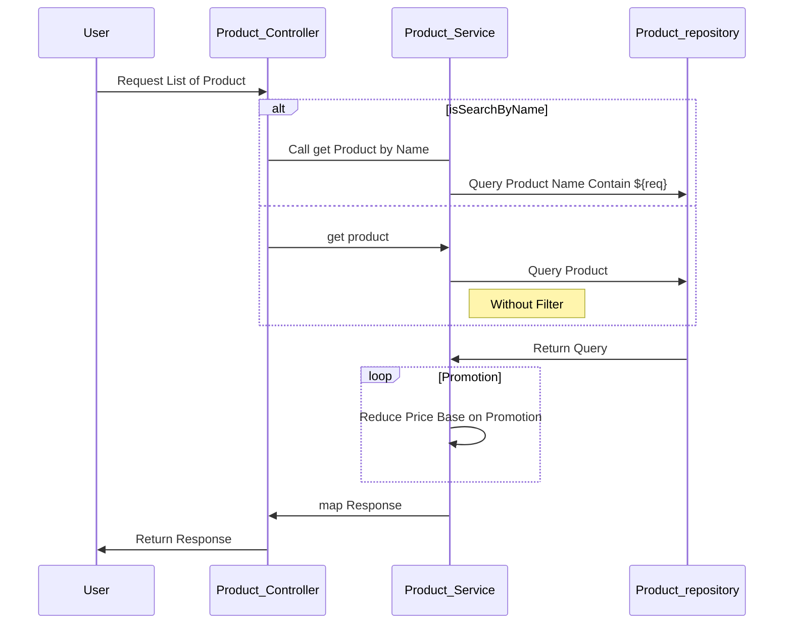
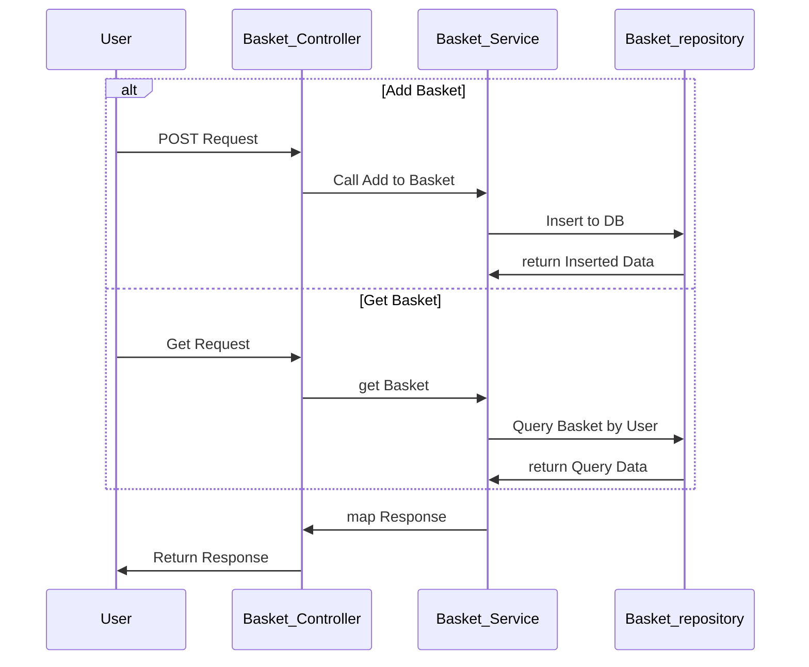
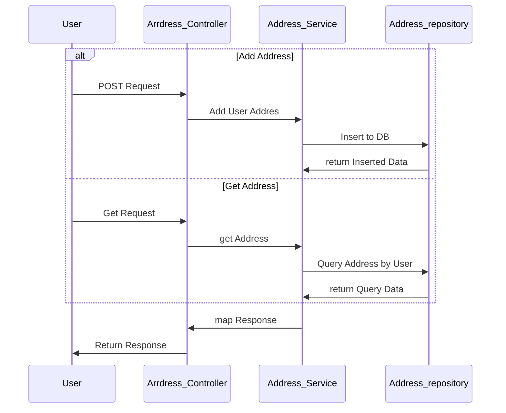
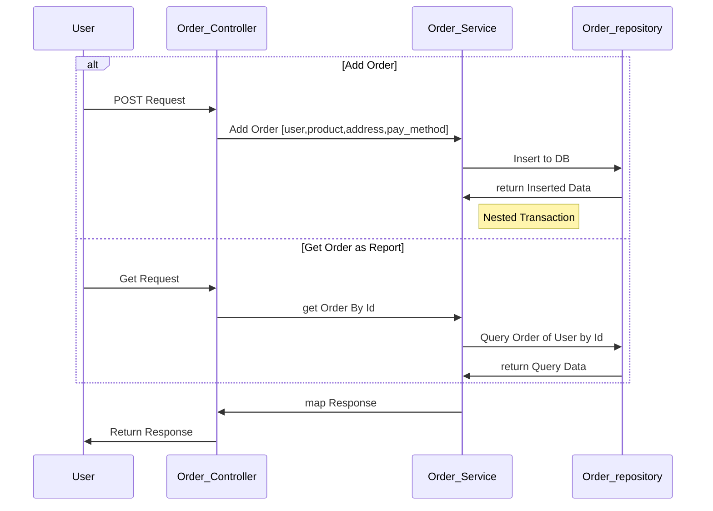

# เอกสาร POC E-Comerce API สำหรับ KBTG WorkShop

****

## สรุป Flow ของการใช้งานของ User จาก UI

**สิ่งที่เรารู้จาก Requirement คือ User มี Account อยู่แล้วจึงสามารถเข้าถึงระบบอื่นๆได้**

### เราจะแยกระบบออกมาเป็น 4  Flow ก็คือ Product, Basket, Order, Summary ตามลำดับดังนี้

1. Flow แรกจากหน้า UI ที่ได้มาคือการแสดงสินค่าจากการค้นหาด้วยชื่อซึ่งจะได้ List ของสินค้าที่มีชื่อที่ User
   กรอกและข้อมูลพื้นฐานเช่น ชื่อ, ราคา, Score เป็นต้น
   * เมื่อ User กดดูข้อมูลของสินค้าจะทำการส่ง Request ซึ่งจะคืน Detail ต่างๆของสินค้ากลับไปให้เช่น Warranty, Size, Option ต่างๆตาม Case และ Type ของสินค้า
   * ซึงก่อนจะมีการคืนราคากลับไปให้ User จะต้องมีการเช็คว่าสินค้านั้นมีการจัดโปรอยู่หรือไม่
###**Product Sequence Diagram**


***

2. Flow หน้า 4 เมื่อ User กด เพื่มสินค้าลงตะกร้าจะทำการส่ง 'POST' ข้อมูลของสินค้าและ User มาตาม
    * ซึ่งจะไปเก็บไว้ใน Table Basket เตรียมไว้สำหรับการที่ User จะนำไปแสดงในหน้า ตรวจสอบสินค้า
    * เมื่อ User เข้าสู่หน้าตรวจสอบสินค้าจะมีการ 'GET' product ที่อยู่ใน Basket Table กลับไปให้หน้าบ้าน

###**Basket Sequence Diagram**


***

3. Flow หน้าที่ 7 เมื่อมีการกดชำระสินค้าจะมีการเข้าไปหา Address ที่ User ได้มีการผูกไว้ในตัวระบบ
    * โดยจะมี 2 Case คือ
        * User ไม่เคย Save Address ไว้ที่ระบบ จะทำการคืนค่า ```[]``` ไปให้เพื่อทำให้เข้าสู่หนน้ากรอกข้อมูล
        * User เคยมีการ Save Address ไว้ที่ระบบแล้วจะคืน ```[Address_Object]``` กลับไปให้เพื่อให้เลือก Address
          ที่จะใช้ในการจัดส่ง
    * หลังจากนั้นจะไป Flow หน้าที่ 8 จะเป็นการที่ User นั้นเลือกชำระเงินซึ่งในแต่ละ แบบจะมีการเก็บข้อมูลที่แตกต่างกัน
    * เมื่อกด **สั่งสินค้า** จะทำการนำข้อมูเหล่านี้ไปเก็บที่ Database
   > **โดยจะต้อง Insert ผ่านทุก Transaction ถึงจะมองว่าการสั่งซื้อนั้นเสร็จสมบูรณ์**

4. Flow ในหน้าที่ 9 นั้นจะเป็นการดึงข้อมูลจากตาราง Order ที่จะเก็บข้อมูลสรุปจาก **ข้อที่ 3** ส่งกลับไปให้ User

###**Address Sequence Diagram**



###**Order Sequence Diagram**


***
## API Spec Document
> ### Document Reading Tips
> **Response** &rarr; ชื่อของ ประเภท Object ที่จะคืนกลับมา ซึ่ง ```[]``` หมายถึงคืนมาในรูปของ Array<br><br>
> **Independent Transaction** &rarr; ใน Process นั้นควรเป็น Nested Transaction ไหม<br><br>
> **NOTE** &rarr; ตัวของ Authorization ต่างๆจะนำมาใช้หลัง WorkShop

| Path            | Method | Independent Transaction | Parameter_Type         | Parameter                                    | Description                  | Response              |
|-----------------|--------|-------------------------|------------------------|----------------------------------------------|------------------------------|-----------------------|
| /user           | GET    | True                    | Header                 | Authorization                                | get User Info                | ```User```            |
| /user/basket    | POST   | True                    | Header & Request_Param | Authorization & product (ID)                 | add Product in User Basket   | ```basketProduct```   |
| /user/basket    | GET    | True                    | Header                 | Authorization                                | get Product in User Basket   | ```[basketProduct]``` |
| /user/address   | POST   | True                    | Header & Body: JSON    | Authorization & ```Address_Request_Object``` | add User Address             | ```userAddress```     |
| /user/address   | GET    | True                    | Header                 | Authorization                                | get User Address             | ```[userAddress]```   |
| /user/order     | POST   | False                   | Header & Body: JSON    | Authorization & ```Order_Requset_Objects ``` | add Purchase to User Order   | ```order```           |
| /user/order     | GET    | True                    | Header & Request_Param | Authorization & issue (orderID)              | get OrderDetailed as Summary | ```OrderDetailed```   |
| /product        | GET    | True                    | -                      | -                                            | get all Product              | ```[product] ```      |
| /product        | GET    | True                    | Request_Param          | name                                         | get Product name contain     | ```product```         | 
| /product/detail | GET    | True                    | Request_Param          | product (ID)                                 | get Product Detail from Id   | ```productDetail```   |    
